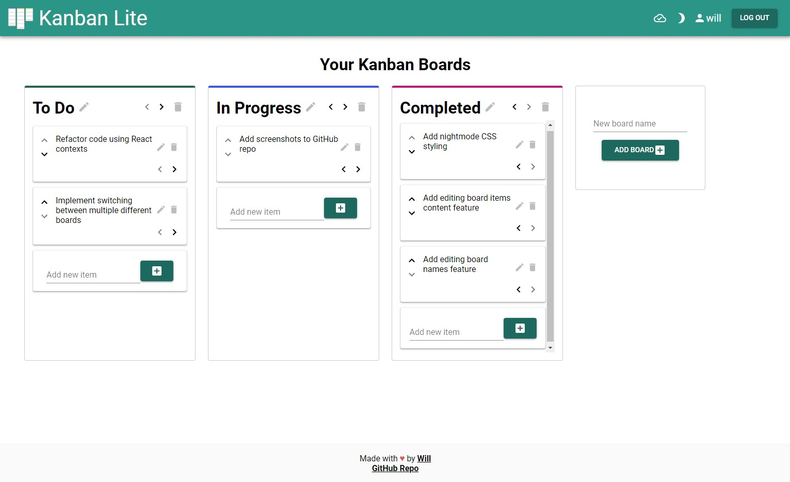

# Kanban Lite
Kanban board website with user accounts, built using the FERN tech stack (**F**irebase, **E**xpress, **R**eact, **N**odeJS).
Currently live at https://kanbanlite.herokuapp.com!

## Features
- Toggleable nightmode on all pages!
- User accounts to save and access your kanban boards between sessions
- Add an infinite number of boards and each are given a random highlight color
- Reorder and move boards and board items however you want
- Edit board names and item content after creating them

## Screenshots

Login page

Login page in nightmode

Home page

Home page in nightmode

