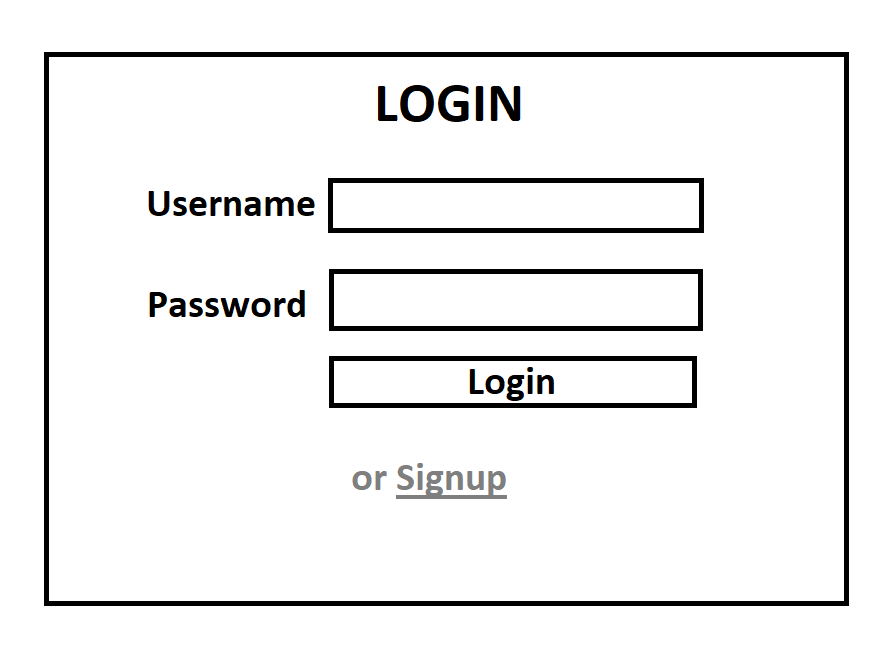
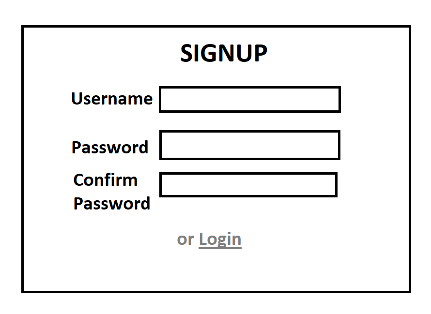
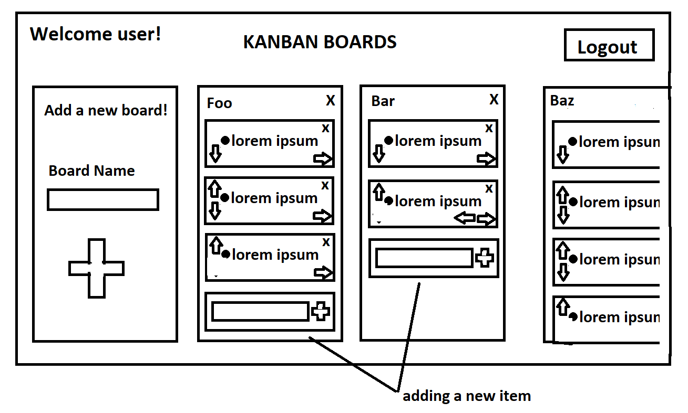

# Features
- Database backed by Firebase
- User sign in/sign out
    - Passwords encrypted using `bcryptjs`
    - Users have their own Kanban board that is preserved across sessions
- User have a login/signup page
- Users can add and delete named boards
    - Users can edit name of boards?
- Users can add and delete items from their boards
    - Users can edit item text?
- Users can move items back and forth across boards
- Users can reorder items on the boards
- Anytime user changes the state of the kanban board, it should be automatically be saved to database
    - May potentially have to add a save button that saves all changes to database instead of live saving

# Website Page Sketches
## Login

## Signup

## Boards
